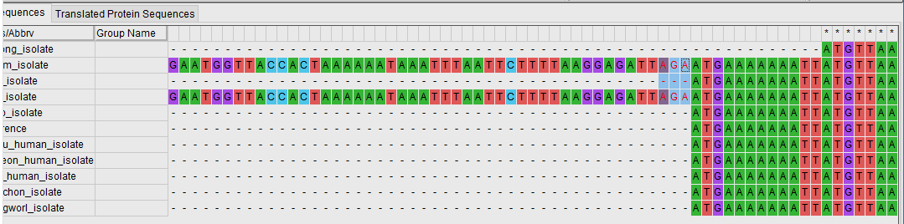
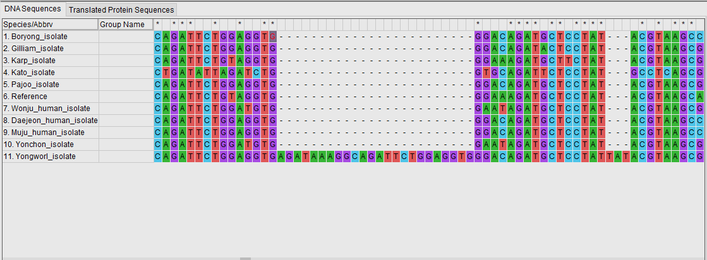
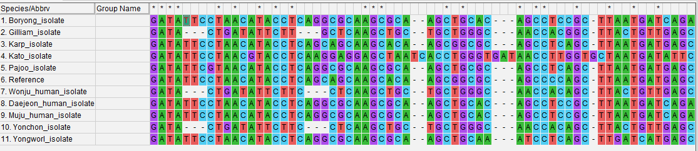
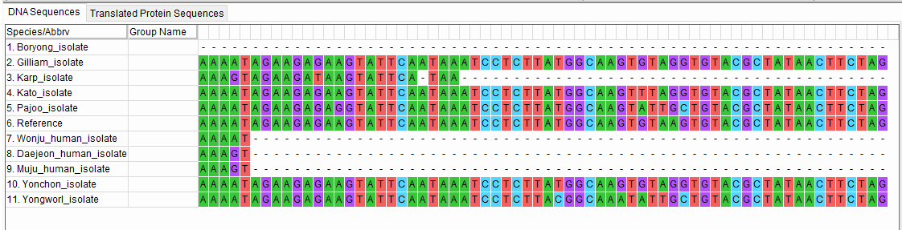
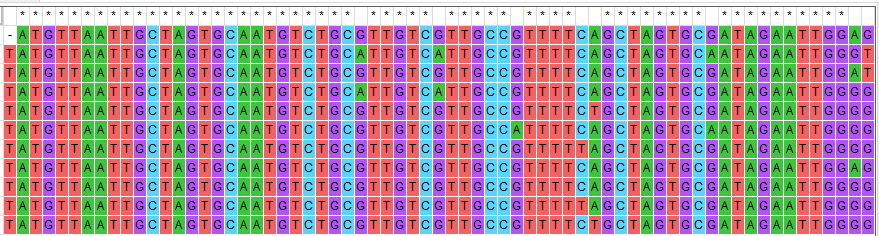
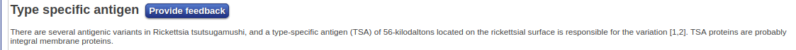
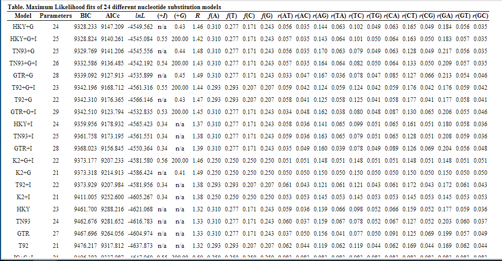
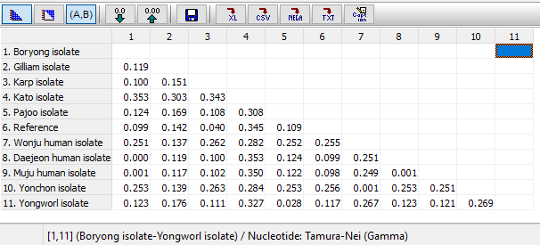

#########################################################################
Alineamiento múltiple y elección del mejor modelo de sustitución.
#########################################################################

*****************************************************
3.1 Algoritmo de alineamiento múltiple seleccionado
*****************************************************

En este estudio estamos trabajando con secuencias de ADN por lo que vamos a trabajar con el algoritmo de **ClustalW**,al igual que los autores del artículo.

El algoritmo empleado por este programa permite el alineamiento de secuencias homólogas de proteínas o nucleótidos. Primero calcula una matriz de distancias entre cada par de secuencias y posteriormente crea un árbol filogenético mediante el método de neighbor-joining que emplea como guía para generar el alineamiento global. 

Las secuencias más similares entre sí son las primeras en alinearse, y posteriormente se van alineando los grupos de secuencias más distantes,hasta conseguir el alineamiento global. 

.. note::  Destacar que los autores del artículo emplean la interfaz CLUSTAL X para realizar el alineamiento,pero a efectos prácticos no supone ninguna diferencia.

*************************************
3.2 Alineamiento múltiple obtenido 
*************************************

El alineamiento de nucleótidos obtenidos para la determinación de la cepa a la que pertenecen las bacterias aisladas de los pacientes humanos se encuentra :download:`aquí.<./Parte1.masx>`

Lo primero que llama la atención de este alineamiento es que existen grandes regiones **no conservadas** entre las distintas cepas, aunque también hay presencia de regiones bien conservadas entre las mismas.

Las secuencias *Gilliam_isolate* y *Kato_isolate* presentan ambas una región inicial de 285 pb que no aparece en el resto de secuencias, incluyendo a la secuencia de referencia de NCBI.

Esto puede ser debido a que en el resto de cepas apareció una delección de esa región inicial, o puede ser debido a que se ha realizado una secuenciación diferente en las diferentes cepas que lleva a esa diferencia de tamaño. 

Otras regiones no conservadas que podemos destacar es la existencia de una delección entre los sitios **653 y 668** *(w/o gaps*) en todas las cepas menos en la cepa *Yongworl*. Igualmente, puede tratarse de una delección que ha aparecido en el resto de las cepas.

También podemos encontrar diferentes deleciones y mutaciones de distinto tipo en la zona entre **1539 - 1620**,que es una de las más variables de la secuencia de esta  proteína.  Otra secuencia variable es la situada entre 776 y 827 pb. Puede que estas zonas pertenezcan a las partes más externas de la proteína,de ahí la gran variabilidad. 

Recalcar que las secuencias **Wonju,Daejeon** y **Muju** terminan antes que el resto de secuencias. Esto puede deberse a una pérdida del final de la proteína pero también puede deberse a que se emplearon diferentes métodos de amplificación y secuenciación de la proteína,ya que estas se tratan de las aisladas de pacientes humanos. La cepa Boryeong es la que más parte terminal de la secuencia ha perdido.

La existencia de grandes regiones no conservadas y diferenciales entre las cepas tiene sentido,puesto que esta secuencia pertenece a una proteína antigénica que se encuentra en la membrana de la bacteria (por lo que está sometida a gran presión evolutiva) y que se emplea para distinguir las diferentes cepas de *O.tsutsugamushi*.

Por otra parte,también podemos encontrar otras **regiones conservadas** entre las distintas cepas,aunque el predominio es de regiones no conservadas.  Destacar la existencia de la región entre la posición 367 y 606,donde hay un gran predominio de regiones conservadas. 

Podemos tomar parte de esta secuencia conservada para realizar una búsqueda en Pfam,que nos va a indicar que se trata de una proteína antigénica específica. 

************************************************************************************
3.3 Elección del mejor modelo de sustitución y cálculo de las distancias genéticas
************************************************************************************

El cálculo de las distancias genéticas (el número de sustituciones acumuladas entre ellas desde que divergieron de un ancestro común) requiere de el empleo de un **modelo de sustitución** que nos permita estimar estas distancias teniendo en cuenta las sustituciones no observables que hayan podido aparecer.  La elección del modelo correcto nos va a permitir que nuestro árbol filogenético sea lo más fiable posible. 

Para ello MEGA nos permite calcular el modelo que mejor se adapte a nuestra secuencia  siguiendo los Criterios de Información Bayesianos y de Akaike (BIC y AIC):

El modelo de sustitución más adecuado que podamos emplear en MEGA en este caso es el modelo **Tamura-Nei (TN93)** con una una distribución gamma asociada (G+) de 0.44.  Este modelo considera tres tasas de mutación; permite que las tasas de las transiciones (A-G C-T) sean distintas entre sí, pero mantiene la misma tasa para las transversiones. 

.. important:: Los autores del artículo no especifican el modelo empleado 

Finalmente hemos obtenido las siguientes distancias:

